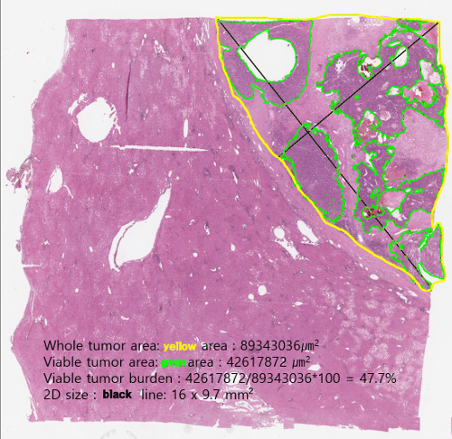

# Liver Tumor Segmentation - PAIP2019: Liver Cancer Segmentation

To use the code, the user needs to pre-install a few packages.
```
$ sudo apt-get install openslide-tools
$ sudo apt-get install libgeos-dev
$ pip install -r requirements.txt
```

## Preprocessing:
### 1. Download slides and unzip
Download all 50 zipped slides and two csv files, put them inside `./data/SourceData`, unzip them by running
```
$ cd preprocess
$ python unzip_slides.py
```
All slides would be unzipped into `./data/LiverImages`.

### 2. Check the segmentation masks
Visualizing the `whole` and `viable` mask of a slide can give the user an intuitive feel on how the tumor looks. Run the following code to generate the side-by-side view of the masks with the corresponding slide image.
```
$ python check_mask.py
```
Moreover, [`tissueloc`](https://github.com/PingjunChen/tissueloc) provides the algorithm to locate the boundary of real tissues in the slide. Running
```
$ python locate_tissue.py
```
The located tissue results may help in slide-level prediction stage. Both mask comparison and tissue localization results are saved in the `./data/Visualization` directory.

### 3. Check the viable tumor burden
If you want to check the provided `viable tumor burden` with the calculated result from provided masks, run the following code:
```
$ cd ../burden
$ python validate_burden.py
```

## Patch-based Slide Segmentation:
### 1. Patch sample generation
Current we use two splitting manners, half-overlap and self-overlap. ``half-overlap`` would have more overlap between neighboring patches, thus obtains more patches. ``self-overlap`` usually have small overlap between neighboring patches, the number of generated patches is much smaller than ``half-overlap``. On both viable and whole tumor types, we would remove those patches that are entirely in non-tissue regions.

**viable tumor patch splitting:**: We combine half-overlap with self-overlap. However, in half-overlap splitting, we control patches by its mask foreground.

**whole tumor patch splitting:** We combine half-overlap with self-overlap with no control on mask foreground ratio. Compared with the viable tumor, whole tumor patch generation can obtain patches, and the ratio of background would be higher, thus avoiding false-positive in whole tumor prediction.

Use the following commands to generate patches for `viable` and `whole` by setting the parameter `tumor_type`.
```
$ cd patches
$ python gen_patches.py
```

### 2. Segmentation model training
#### 2.1 Model selection
We explore UNet and PSPNet on liver patch segmentation. Experimental results show that PSPNet achieves superior performance.
#### 2.2 Optimizer
We compare SGD with initial learning rate 1.0e-2 and Adam with initial learning rate 1.0e-3. On both PSPNet and UNet, SGD presents superior performance. We train the segmentation model for 50 epochs and decay the learning rate with epoch-wise down-stepping until 0.0.
#### 2.3 Loss function
Binary cross-entropy (BCE) and dice loss are combined as the overall loss. BCE-0.1 achieves the most promising results.
#### 2.4 Patch normalization
We compare applying patch normalization and no patch normalization. The prediction performance on validation patches shows that applying no normalization performs a little bit better. Besides, without normalization is also more convenient to implement.

The patch training can be run as follows, we train `viable` and `whole` with the same settings:
```
$ cd seg
$ python train_seg.py
```

The Caffe pretrained PSPNet needs to be downloaded from [Here](https://drive.google.com/open?id=0BzaU285cX7TCT1M3TmNfNjlUeEU) and put it in `seg/segnet/pspnet/`.


### 3. Slide tumor prediction
The slide-level segmentation is also conducted in a patch-wise manner. To be specific, we first split whole slide images into patches, and then we predict each patch. At last, we merge all patches' predictions to generate the final tumor segmentation result.

Here the main issue is how to split the whole slide image. To make the slide-level segmentation to be more robust, we adopt a stride-wise patch splitting method and set the stride to be small (64 used). When the stride is small, each pixel would lie in more patches and thus would be predicted more times. As we would average the predictions to get the final prediction, each pixel's segmentation prediction would be more robust if it is predicted more times in multiple different contexts. However, the time cost would linearly increase with the number of patches. In the current application, we take the segmentation accuracy as the priority.

<p>
  
</p>

Before predicting on test slides, we copy the best-performed model and paste it to `BestModel` folder for both `viable` and `whole`, then run
```
$ cd seg
$ python pred_test_slide.py
```

After `viable` and `whole` tumor regions are predicted, we calculate the tumor burden with
```
$ cd burden
$ python pred_burden.py
```

## Acknowledgements
- [shahabty/PSPNet-Pytorch](https://github.com/shahabty/PSPNet-Pytorch)
- [hszhao/PSPNet](https://github.com/hszhao/PSPNet)
- [usuyama/pytorch-unet](https://github.com/usuyama/pytorch-unet)
